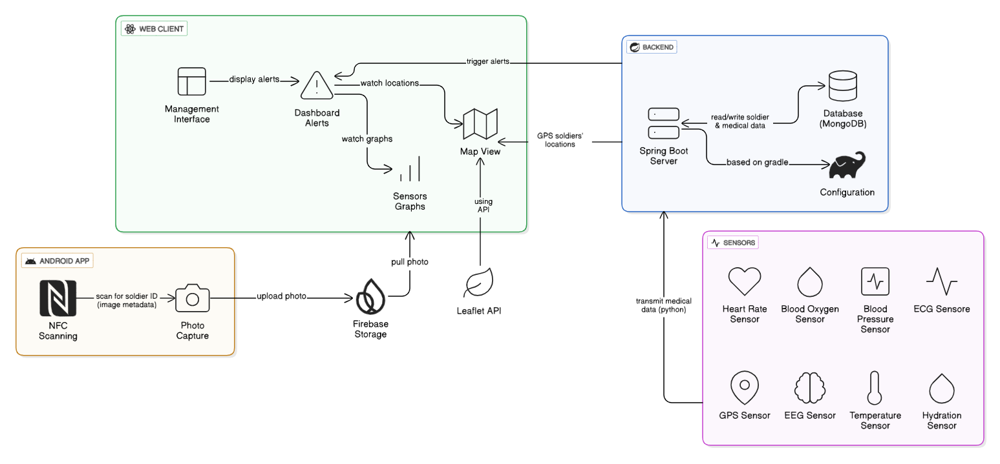

<p align="center">
  
</p>

<h1 align="center">SoldiCare – Real-Time Soldier Health Monitoring</h1>

SoldiCare is a modular system designed to monitor soldiers' health in real time, providing commanders with updated medical statuses and critical alerts through web and mobile interfaces. The system integrates sensors, server-side logic, and visual dashboards to enhance field awareness and decision-making.

## 👨‍🎓 Students

- Itay Chabra
- Neta Ben Mordechai
- Sapir Gilany
- Idan Noyshul
- Roi Dor

## 🔖 Repository Structure

Each folder contains its own `README.md` file with detailed documentation:

```
📁 documents           → presentation , project requierments document , architecture diagrams
📁 gherkin             → BDD feature files written in Gherkin syntax
📁 soldicare-backend   → Spring Boot server with REST API and MongoDB
📁 soldicare-clients   → React + TypeScript frontend for command center
📁 soldicare-mobile    → Android app with NFC and camera integrations
📁 soldicare-scripts   → Python-based sensor simulators
📄 README.md           → You are here
```

## 🎨 Figma Design

You can explore the interactive UI prototype [in Figma here](https://www.figma.com/proto/43qIOgPMebtNUFH7DxfyZM/SoldiCare?node-id=484-2657&p=f&t=F29SvMSy3w1onKS8-0&scaling=scale-down-width&content-scaling=fixed&page-id=0%3A1&starting-point-node-id=484%3A2657&show-proto-sidebar=1).

## 🎥 Project - Video

Watch the full project demo on [YouTube here](https://www.youtube.com/watch?v=EvG0k-AL1xk).

## 🏗️ Architecture



## 🧪 Technologies Used

### 🖥 Server Side – Spring Boot

- **Spring Boot**: Modular and scalable REST API
- **MongoDB**: NoSQL database for nested soldier-sensor-alert structure
- **YAML + Docker**: Local dev configuration with MongoDB Docker image
- **CI/CD + Render**: Automatic deployment on pull request via Docker
- **Testing**: BDD with Gherkin + JUnit

### 🌐 Frontend Web – React

- **React + TypeScript**: SPA with strong typing
- **Material UI**: Responsive design components
- **Leaflet**: Real-time map visualization
- **Recharts**: Time-series charts for sensor data
- **Firebase**: Image storage & metadata

### 📱 Android Mobile App

- **Java + Kotlin**: Logic + Gradle builds
- **CameraX**: Soldier photo capture
- **NFC APIs**: Tag detection and data reading
- **UI**: Material Components, ConstraintLayout, Animations

### ⚙️ Sensor Simulator

- **Python + requests**: Simulates real-time sensor data
- **Spring REST integration**: Sends data directly to backend API

📄 [Full tech breakdown here](./documents/Final Project Requirements Document.pdf)

## 🚀 How to Run the Project

Follow these step-by-step instructions to run the full SoldiCare system locally.

---

### 1. Run the Database with Docker

```bash
cd soldicare-backend/2025b.Itay.Chabra/
docker compose up -d
```

This command starts a MongoDB instance as defined in the `docker-compose.yml` file.

---

### 2. Run the Spring Boot Backend

```bash
cd soldicare-backend/2025b.Itay.Chabra/
```

- Open the project using **Spring Tool Suite (STS)** or any compatible Java IDE.
- Run the main Spring Boot application.
- Ensure MongoDB is running before you start the backend.

---

### 3. Install Python Dependencies (Sensor Simulation)

Before running the sensor simulator script, make sure you install the required Python libraries:

```bash
pip install requests
```

### 4. Run the Sensor Simulation Script

```bash
cd soldicare-scripts/
python sensor_simulator.py
```

This script simulates health data from sensors and sends it to the backend.

---

### 5. Run the Web Client (Frontend)

```bash
cd soldicare-clients/
npm install
npm run dev
```

Then open your browser at: [http://localhost:5173/](http://localhost:5173/)

### 🔐 Login – Test Accounts

To log in to the system, you can use one of the following test users:

| Email           | Role     |
| --------------- | -------- |
| jane@demo.org   | ADMIN    |
| joanna@demo.org | OPERATOR |
| jack@demo.org   | END_USER |

Recommended: use `joanna@demo.org`  
SystemID: `2025b.Itay.Chabra`

---

### 6. Run the Android Application

```bash
cd soldicare-mobile/
```

#### Open Android Studio

- Go to **File → Open**
- Select the cloned `soldicare-android-app` folder
- Run the app using **Shift + F10** or click the green ▶️ play button
- Grant **camera permissions** when prompted

---

#### Prepare NFC Tags

- Use the **NFC Tools** app
- Write soldier IDs to NFC tags as plain **text**
- Format: `7654321` (soldier serial number)

---

#### Use the App

1. 📱 Open the **Soldicare** app
2. 🏷 Scan a soldier's **NFC tag**  
   → You should see: `NFC ID: [number]`
3. 📷 Tap the **camera** button  
   → The photo uploads automatically
4. ✅ You will see: **"Photo uploaded"** confirmation
